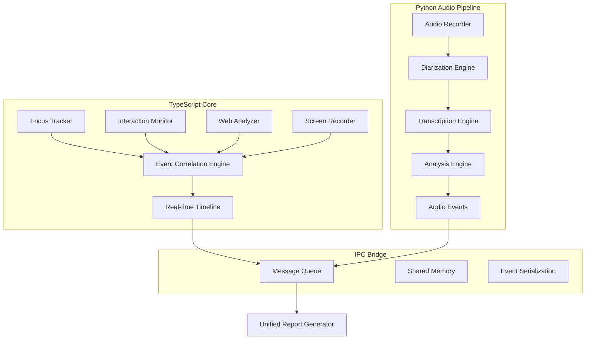

# Architecture Decisions Document

## ADR-001: Hybrid TypeScript-Python Architecture

**Date:** December 16, 2024  
**Status:** Accepted  
**Decision Makers:** Development Team  

### Context and Problem Statement

TrackerA11y requires both real-time system integration capabilities and advanced machine learning audio processing. The platform must:

1. **Real-time Performance**: Monitor system events, user interactions, and application focus with microsecond precision
2. **Cross-Platform Integration**: Access native OS accessibility APIs across Windows, macOS, and Linux
3. **Advanced Audio Processing**: Perform speaker diarization and high-quality transcription using state-of-the-art ML models
4. **Web Technology Integration**: Interface with browser DevTools and web accessibility frameworks
5. **Developer Experience**: Provide excellent tooling, debugging, and ecosystem integration

### Decision

**Adopt a hybrid TypeScript-Python architecture** with clear separation of concerns:

- **TypeScript Core**: Real-time orchestration, system integration, and API layer
- **Python Audio Pipeline**: Machine learning audio processing and analysis
- **IPC Bridge**: Efficient inter-process communication between components

### Rationale

#### TypeScript Core Advantages

**1. Real-Time System Performance**
```typescript
// Excellent for high-frequency event processing
class EventCorrelationEngine {
  private events: TimestampedEvent[] = [];
  
  // Sub-millisecond event correlation
  correlateInRealTime(newEvent: TimestampedEvent): CorrelatedEvent[] {
    // V8 engine optimizations for real-time processing
    return this.findCorrelations(newEvent, this.recentEvents());
  }
}
```

**2. Native OS Integration**
- **Windows**: Easy integration with Windows API via Node.js native addons
- **macOS**: Direct access to NSAccessibility and Core Foundation APIs
- **Linux**: Integration with AT-SPI accessibility infrastructure
- **Cross-Platform**: Single codebase with platform-specific implementations

**3. Web Ecosystem Integration**
```typescript
// Native understanding of web technologies
import { Protocol } from 'devtools-protocol';

class WebAccessibilityAnalyzer {
  async analyzeAccessibilityTree(): Promise<AccessibilityNode[]> {
    // Direct Chrome DevTools Protocol integration
    const {nodes} = await this.cdp.send('Accessibility.getFullAXTree');
    return nodes.map(node => this.parseAccessibilityNode(node));
  }
}
```

**4. Developer Experience**
- **Rich Ecosystem**: 2M+ npm packages for testing, CI/CD, and integrations
- **Type Safety**: Prevents bugs in complex event correlation logic
- **Tooling**: Excellent IDE support, debugging, and profiling tools
- **API Development**: Express.js, WebSocket, and REST API frameworks

#### Python Audio Pipeline Advantages

**1. Machine Learning Excellence**
```python
# Unmatched ML/AI ecosystem for audio processing
from pyannote.audio import Pipeline
import whisper
import torch

class AudioAnalysisEngine:
    def __init__(self):
        # State-of-the-art diarization
        self.diarization = Pipeline.from_pretrained(
            "pyannote/speaker-diarization-3.1",
            use_auth_token=True
        )
        
        # Advanced transcription
        self.whisper = whisper.load_model("large-v3")
        
    def process_audio(self, audio_path: str) -> DiarizedTranscription:
        # Speaker separation
        diarization = self.diarization(audio_path)
        
        # Role-aware transcription
        return self.transcribe_with_speakers(audio_path, diarization)
```

**2. Audio Processing Libraries**
- **pyannote.audio**: Industry-leading speaker diarization
- **OpenAI Whisper**: State-of-the-art speech recognition
- **librosa**: Advanced audio analysis and feature extraction
- **scipy**: Signal processing and audio manipulation
- **torch/tensorflow**: Deep learning model integration

**3. Research and Prototyping**
- **Jupyter Notebooks**: Rapid experimentation and analysis
- **Scientific Computing**: NumPy, SciPy, pandas for data analysis
- **Visualization**: matplotlib, seaborn for audio analysis visualization

#### Hybrid Architecture Benefits

**1. Best of Both Worlds**
- TypeScript handles real-time system events and orchestration
- Python handles computationally intensive ML audio processing
- Each language used for its optimal use case

**2. Scalability**
- Audio processing can be scaled independently
- Core system remains responsive during heavy audio analysis
- Microservice architecture enables horizontal scaling

**3. Maintainability**
- Clear separation of concerns
- Independent development and testing of components
- Different teams can specialize in different technology stacks

### Architecture Overview



### Implementation Strategy

#### Phase 1: Foundation Components

**TypeScript Core Components:**
```typescript
// src/core/TrackerA11yCore.ts
export class TrackerA11yCore {
  private focusTracker: FocusTracker;
  private interactionMonitor: InteractionMonitor;
  private correlationEngine: EventCorrelationEngine;
  private audioProcessor: AudioProcessorBridge;
  
  async initialize(): Promise<void> {
    // Initialize real-time monitoring
    await this.focusTracker.startMonitoring();
    await this.interactionMonitor.startMonitoring();
    
    // Start audio processing pipeline
    await this.audioProcessor.initializePythonPipeline();
  }
}
```

**Python Audio Pipeline:**
```python
# audio_pipeline/processor.py
class AudioProcessor:
    def __init__(self):
        self.diarization_pipeline = Pipeline.from_pretrained(
            "pyannote/speaker-diarization-3.1"
        )
        self.transcription_model = whisper.load_model("large-v3")
        
    def process_audio_stream(self, audio_data: bytes) -> ProcessedAudio:
        # Real-time audio analysis
        pass
```

#### Inter-Process Communication

**Message Queue Bridge:**
```typescript
// src/bridge/AudioProcessorBridge.ts
import { spawn } from 'child_process';

export class AudioProcessorBridge {
  private pythonProcess: ChildProcess;
  
  async initializePythonPipeline(): Promise<void> {
    this.pythonProcess = spawn('python', [
      '-m', 'audio_pipeline.main',
      '--mode', 'ipc'
    ]);
    
    this.pythonProcess.stdout.on('data', this.handleAudioEvents.bind(this));
  }
  
  async sendAudioData(audioBuffer: Buffer): Promise<void> {
    // Send audio data to Python pipeline
    this.pythonProcess.stdin.write(audioBuffer);
  }
}
```

### Technology Stack

#### TypeScript Core Stack
- **Runtime**: Node.js 18+
- **Language**: TypeScript 5.0+
- **Testing**: Jest + ts-jest
- **Build**: tsc + esbuild for optimization
- **Native Addons**: node-addon-api for OS integration
- **Communication**: WebSocket, IPC, REST APIs

#### Python Audio Stack
- **Runtime**: Python 3.9+
- **Audio Processing**: pyannote.audio, whisper, librosa
- **ML Framework**: PyTorch (for pyannote and whisper)
- **Data Processing**: NumPy, SciPy, pandas
- **Communication**: asyncio, multiprocessing, zmq

#### Development Tools
- **Version Control**: Git with conventional commits
- **CI/CD**: GitHub Actions for both TypeScript and Python
- **Testing**: Jest (TypeScript) + pytest (Python)
- **Linting**: ESLint (TypeScript) + flake8/black (Python)
- **Documentation**: TypeDoc + Sphinx

### Risks and Mitigation

#### Risk 1: Inter-Process Communication Complexity
**Mitigation:** 
- Use established IPC patterns (message queues, shared memory)
- Comprehensive error handling and retry logic
- Fallback mechanisms for audio processing failures

#### Risk 2: Deployment Complexity
**Mitigation:**
- Docker containerization for both components
- Package both TypeScript and Python dependencies
- Automated deployment scripts and health checks

#### Risk 3: Performance Overhead
**Mitigation:**
- Efficient serialization (Protocol Buffers or MessagePack)
- Shared memory for large audio data transfers
- Async processing to prevent blocking

### Future Considerations

1. **Microservice Evolution**: Components can be extracted into separate services
2. **Language Alternatives**: Rust for performance-critical components
3. **Cloud Deployment**: Containerized deployment with orchestration
4. **API Gateway**: RESTful API layer for external integrations

### Decision Validation

This architecture provides:
- ✅ **Performance**: Real-time event processing with TypeScript
- ✅ **AI Capabilities**: State-of-the-art audio analysis with Python
- ✅ **Maintainability**: Clear separation of concerns
- ✅ **Scalability**: Independent scaling of components
- ✅ **Developer Experience**: Best tooling for each use case

### References

- [Node.js Native Addons Documentation](https://nodejs.org/api/addons.html)
- [pyannote.audio Documentation](https://github.com/pyannote/pyannote-audio)
- [OpenAI Whisper Documentation](https://github.com/openai/whisper)
- [Chrome DevTools Protocol](https://chromedevtools.github.io/devtools-protocol/)