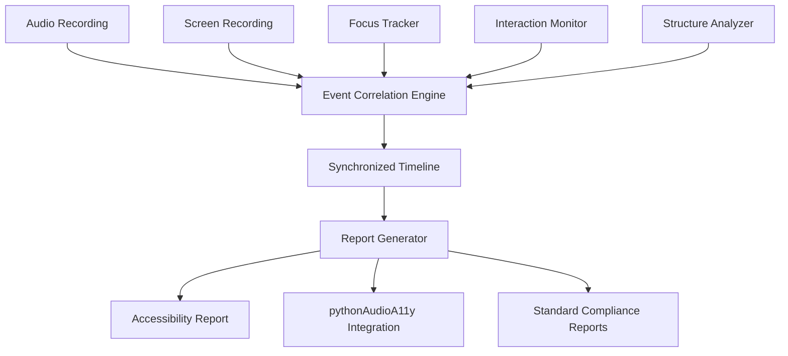

# TrackerA11y Implementation Guide

## Overview

This comprehensive implementation guide provides practical, step-by-step instructions for building TrackerA11y's core accessibility testing capabilities. The guide includes detailed code examples, architecture patterns, and integration strategies based on the extensive research conducted.

## Table of Contents

1. [System Architecture](#system-architecture)
2. [Core Components](#core-components)
3. [Platform-Specific Implementation](#platform-specific-implementation)
4. [Integration Patterns](#integration-patterns)
5. [Performance Optimization](#performance-optimization)
6. [Testing and Validation](#testing-and-validation)
7. [Deployment Strategies](#deployment-strategies)

## System Architecture

### High-Level Architecture

```typescript
// Core system architecture interfaces
interface TrackerA11ySystem {
  focusTracker: ApplicationFocusTracker;
  interactionMonitor: UserInteractionMonitor;
  structureAnalyzer: AccessibilityStructureAnalyzer;
  syncManager: AudioVideoSynchronization;
  correlationEngine: EventCorrelationEngine;
  reportGenerator: AccessibilityReportGenerator;
}

interface TrackerA11yConfig {
  platforms: ('web' | 'ios' | 'android' | 'windows' | 'macos' | 'linux')[];
  syncPrecision: 'millisecond' | 'microsecond' | 'nanosecond';
  realTimeMonitoring: boolean;
  audioIntegration: {
    pythonAudioA11yCompatible: boolean;
    synchronizationMethod: 'bwf' | 'smpte' | 'ptp';
  };
  outputFormats: ('json' | 'xml' | 'axe-core' | 'lighthouse' | 'wcag-em')[];
}
```

### Component Interaction Diagram



## Core Components

### 1. Application Focus Tracker

#### Cross-Platform Focus Manager

```typescript
// src/core/focus/FocusManager.ts
import { EventEmitter } from 'events';

export interface FocusEvent {
  timestamp: number; // microseconds
  applicationName: string;
  windowTitle: string;
  processId: number;
  platform: string;
  accessibilityContext?: any;
}

export abstract class PlatformFocusTracker extends EventEmitter {
  abstract startMonitoring(): Promise<void>;
  abstract stopMonitoring(): Promise<void>;
  abstract getCurrentFocus(): Promise<FocusEvent | null>;
}

export class FocusManager {
  private tracker: PlatformFocusTracker;
  private isMonitoring = false;

  constructor() {
    this.tracker = this.createPlatformTracker();
  }

  private createPlatformTracker(): PlatformFocusTracker {
    const platform = process.platform;
    
    switch (platform) {
      case 'win32':
        return new WindowsFocusTracker();
      case 'darwin':
        return new MacOSFocusTracker();
      case 'linux':
        return new LinuxFocusTracker();
      default:
        throw new Error(`Unsupported platform: ${platform}`);
    }
  }

  async startMonitoring(): Promise<void> {
    if (this.isMonitoring) return;
    
    this.tracker.on('focusChanged', this.handleFocusChange.bind(this));
    await this.tracker.startMonitoring();
    this.isMonitoring = true;
  }

  private handleFocusChange(event: FocusEvent): void {
    // Enrich with accessibility context
    this.enrichWithAccessibilityContext(event);
    
    // Emit to correlation engine
    this.emit('focusEvent', event);
  }

  private async enrichWithAccessibilityContext(event: FocusEvent): Promise<void> {
    // Platform-specific accessibility context extraction
    try {
      const context = await this.tracker.getAccessibilityContext?.(event.processId);
      event.accessibilityContext = context;
    } catch (error) {
      console.warn('Failed to get accessibility context:', error);
    }
  }
}
```

#### Windows Implementation

```typescript
// src/core/focus/platforms/WindowsFocusTracker.ts
import { exec } from 'child_process';
import { promisify } from 'util';
import { PlatformFocusTracker, FocusEvent } from '../FocusManager';

const execAsync = promisify(exec);

export class WindowsFocusTracker extends PlatformFocusTracker {
  private monitoringHandle: NodeJS.Timeout | null = null;

  async startMonitoring(): Promise<void> {
    // Use PowerShell to monitor window focus changes
    const script = `
      Add-Type -AssemblyName UIAutomationClient
      Add-Type -AssemblyName UIAutomationTypes

      while ($true) {
        try {
          $foregroundWindow = [Win32.User32]::GetForegroundWindow()
          $processId = [Win32.User32]::GetWindowThreadProcessId($foregroundWindow, [ref]0)
          $process = Get-Process -Id $processId -ErrorAction SilentlyContinue
          
          if ($process) {
            $windowTitle = [Win32.User32]::GetWindowText($foregroundWindow)
            $timestamp = [DateTimeOffset]::UtcNow.ToUnixTimeMilliseconds() * 1000
            
            $focusData = @{
              timestamp = $timestamp
              applicationName = $process.ProcessName
              windowTitle = $windowTitle
              processId = $processId
              platform = "windows"
            }
            
            Write-Output (ConvertTo-Json $focusData -Compress)
          }
        }
        catch {
          # Silent error handling
        }
        
        Start-Sleep -Milliseconds 50
      }
    `;

    this.runMonitoringScript(script);
  }

  private runMonitoringScript(script: string): void {
    const powershell = spawn('powershell.exe', ['-Command', script]);
    
    powershell.stdout.on('data', (data) => {
      try {
        const focusEvent = JSON.parse(data.toString().trim());
        this.emit('focusChanged', focusEvent as FocusEvent);
      } catch (error) {
        console.warn('Failed to parse focus event:', error);
      }
    });

    powershell.stderr.on('data', (data) => {
      console.error('PowerShell error:', data.toString());
    });
  }

  async getCurrentFocus(): Promise<FocusEvent | null> {
    try {
      const { stdout } = await execAsync(`
        powershell -Command "
          $fg = [Win32.User32]::GetForegroundWindow();
          $pid = [Win32.User32]::GetWindowThreadProcessId($fg, [ref]0);
          $proc = Get-Process -Id $pid;
          @{name=$proc.ProcessName; title=[Win32.User32]::GetWindowText($fg)} | ConvertTo-Json"
      `);

      const result = JSON.parse(stdout.trim());
      return {
        timestamp: Date.now() * 1000, // Convert to microseconds
        applicationName: result.name,
        windowTitle: result.title,
        processId: 0, // Would be filled in by actual implementation
        platform: 'windows'
      };
    } catch (error) {
      console.error('Failed to get current focus:', error);
      return null;
    }
  }

  async stopMonitoring(): Promise<void> {
    if (this.monitoringHandle) {
      clearTimeout(this.monitoringHandle);
      this.monitoringHandle = null;
    }
  }
}
```

### 2. User Interaction Monitor

#### Unified Interaction Tracking

```typescript
// src/core/interaction/InteractionMonitor.ts
export interface InteractionEvent {
  id: string;
  timestamp: number; // microseconds
  type: 'mouse' | 'keyboard' | 'touch' | 'voice' | 'accessibility';
  data: any;
  target?: {
    elementId?: string;
    coordinates?: { x: number; y: number };
    accessibilityInfo?: any;
  };
  context?: {
    focusedApplication: string;
    activeElement?: string;
    screenReaderActive: boolean;
  };
}

export class InteractionMonitor extends EventEmitter {
  private monitors: Map<string, any> = new Map();
  private correlationEngine: EventCorrelationEngine;

  constructor(correlationEngine: EventCorrelationEngine) {
    super();
    this.correlationEngine = correlationEngine;
    this.setupPlatformMonitors();
  }

  private setupPlatformMonitors(): void {
    // Mouse/pointer monitoring
    this.monitors.set('mouse', new MouseInteractionMonitor());
    
    // Keyboard monitoring  
    this.monitors.set('keyboard', new KeyboardInteractionMonitor());
    
    // Touch monitoring (mobile platforms)
    if (this.isMobilePlatform()) {
      this.monitors.set('touch', new TouchInteractionMonitor());
    }

    // Accessibility tool monitoring
    this.monitors.set('accessibility', new AccessibilityInteractionMonitor());

    // Voice command monitoring
    if (this.supportsVoiceCommands()) {
      this.monitors.set('voice', new VoiceInteractionMonitor());
    }

    // Setup event forwarding
    this.monitors.forEach((monitor, type) => {
      monitor.on('interaction', (event: InteractionEvent) => {
        this.handleInteraction(event);
      });
    });
  }

  private handleInteraction(event: InteractionEvent): void {
    // Enrich with context
    this.enrichWithContext(event);
    
    // Forward to correlation engine
    this.correlationEngine.addInteraction(event);
    
    // Emit for other listeners
    this.emit('interaction', event);
  }

  private async enrichWithContext(event: InteractionEvent): Promise<void> {
    try {
      // Get current application focus
      const focusInfo = await this.getCurrentFocusContext();
      
      // Get accessibility context
      const a11yContext = await this.getAccessibilityContext();
      
      event.context = {
        focusedApplication: focusInfo?.applicationName || 'unknown',
        activeElement: focusInfo?.activeElement,
        screenReaderActive: a11yContext?.screenReaderActive || false
      };
    } catch (error) {
      console.warn('Failed to enrich interaction context:', error);
    }
  }

  async startMonitoring(): Promise<void> {
    const promises = Array.from(this.monitors.values()).map(monitor => 
      monitor.startMonitoring()
    );
    
    await Promise.all(promises);
  }

  async stopMonitoring(): Promise<void> {
    const promises = Array.from(this.monitors.values()).map(monitor => 
      monitor.stopMonitoring()
    );
    
    await Promise.all(promises);
  }
}
```

#### Keyboard Interaction Monitor

```typescript
// src/core/interaction/KeyboardInteractionMonitor.ts
export class KeyboardInteractionMonitor extends EventEmitter {
  private globalKeyListener: any;

  async startMonitoring(): Promise<void> {
    if (process.platform === 'darwin') {
      await this.startMacOSMonitoring();
    } else if (process.platform === 'win32') {
      await this.startWindowsMonitoring();
    } else {
      await this.startLinuxMonitoring();
    }
  }

  private async startMacOSMonitoring(): Promise<void> {
    // Use node-global-key-listener for cross-platform key monitoring
    const GlobalKeyboardListener = require('node-global-key-listener').GlobalKeyboardListener;
    
    this.globalKeyListener = new GlobalKeyboardListener({
      mac: {
        onError: (errorCode: any) => console.error('macOS key listener error:', errorCode)
      }
    });

    this.globalKeyListener.addListener((e: any, down: any) => {
      const event: InteractionEvent = {
        id: `key_${Date.now()}_${Math.random()}`,
        timestamp: this.getHighPrecisionTimestamp(),
        type: 'keyboard',
        data: {
          key: e.name,
          state: down ? 'down' : 'up',
          modifiers: {
            shift: e.shift,
            ctrl: e.ctrl,
            alt: e.alt,
            meta: e.meta
          },
          isAccessibilityKey: this.isAccessibilityKey(e.name),
          scanCode: e.scanCode,
          rawKey: e.rawKey
        }
      };

      this.emit('interaction', event);
    });
  }

  private async startWindowsMonitoring(): Promise<void> {
    // Windows-specific low-level keyboard hook implementation
    const { spawn } = require('child_process');
    
    const hookScript = `
      Add-Type -TypeDefinition @"
        using System;
        using System.Diagnostics;
        using System.Runtime.InteropServices;
        using System.Windows.Forms;
        
        public static class KeyboardHook {
          private const int WH_KEYBOARD_LL = 13;
          private const int WM_KEYDOWN = 0x0100;
          private const int WM_KEYUP = 0x0101;
          
          private static LowLevelKeyboardProc _proc = HookCallback;
          private static IntPtr _hookID = IntPtr.Zero;
          
          public delegate IntPtr LowLevelKeyboardProc(int nCode, IntPtr wParam, IntPtr lParam);
          
          [DllImport("user32.dll", CharSet = CharSet.Auto, SetLastError = true)]
          private static extern IntPtr SetWindowsHookEx(int idHook,
            LowLevelKeyboardProc lpfn, IntPtr hMod, uint dwThreadId);
            
          [DllImport("user32.dll", CharSet = CharSet.Auto, SetLastError = true)]
          [return: MarshalAs(UnmanagedType.Bool)]
          private static extern bool UnhookWindowsHookEx(IntPtr hhk);
          
          [DllImport("user32.dll", CharSet = CharSet.Auto, SetLastError = true)]
          private static extern IntPtr CallNextHookEx(IntPtr hhk, int nCode,
            IntPtr wParam, IntPtr lParam);
            
          public static void StartHook() {
            _hookID = SetWindowsHookEx(WH_KEYBOARD_LL, _proc,
              GetModuleHandle("user32"), 0);
          }
          
          private static IntPtr HookCallback(int nCode, IntPtr wParam, IntPtr lParam) {
            if (nCode >= 0) {
              int vkCode = Marshal.ReadInt32(lParam);
              string keyState = (wParam == (IntPtr)WM_KEYDOWN) ? "down" : "up";
              long timestamp = DateTimeOffset.UtcNow.ToUnixTimeMilliseconds() * 1000;
              
              Console.WriteLine($"{{""timestamp"":{timestamp},""key"":{vkCode},""state"":""{keyState}""}}");
            }
            
            return CallNextHookEx(_hookID, nCode, wParam, lParam);
          }
        }
"@

      [KeyboardHook]::StartHook()
      
      while ($true) {
        Start-Sleep -Seconds 1
      }
    `;

    const powershell = spawn('powershell.exe', ['-Command', hookScript]);
    
    powershell.stdout.on('data', (data) => {
      try {
        const keyData = JSON.parse(data.toString().trim());
        
        const event: InteractionEvent = {
          id: `key_${Date.now()}_${Math.random()}`,
          timestamp: keyData.timestamp,
          type: 'keyboard',
          data: {
            virtualKeyCode: keyData.key,
            state: keyData.state,
            keyName: this.virtualKeyCodeToName(keyData.key),
            isAccessibilityKey: this.isAccessibilityKey(keyData.key)
          }
        };

        this.emit('interaction', event);
      } catch (error) {
        console.warn('Failed to parse keyboard event:', error);
      }
    });
  }

  private getHighPrecisionTimestamp(): number {
    return performance.now() * 1000; // Convert to microseconds
  }

  private isAccessibilityKey(keyName: string): boolean {
    const accessibilityKeys = [
      'Tab', 'Enter', 'Space', 'Escape', 'ArrowUp', 'ArrowDown', 
      'ArrowLeft', 'ArrowRight', 'Home', 'End', 'PageUp', 'PageDown',
      'F6', 'F10' // Common screen reader keys
    ];
    
    return accessibilityKeys.includes(keyName);
  }

  private virtualKeyCodeToName(vkCode: number): string {
    const keyMap: { [key: number]: string } = {
      9: 'Tab', 13: 'Enter', 27: 'Escape', 32: 'Space',
      37: 'ArrowLeft', 38: 'ArrowUp', 39: 'ArrowRight', 40: 'ArrowDown',
      36: 'Home', 35: 'End', 33: 'PageUp', 34: 'PageDown'
    };
    
    return keyMap[vkCode] || `VK_${vkCode}`;
  }

  async stopMonitoring(): Promise<void> {
    if (this.globalKeyListener) {
      this.globalKeyListener.kill();
      this.globalKeyListener = null;
    }
  }
}
```

### 3. Accessibility Structure Analyzer

#### DOM and Native App Analysis

```typescript
// src/core/structure/StructureAnalyzer.ts
export interface AccessibilityNode {
  id: string;
  role: string;
  name?: string;
  description?: string;
  value?: any;
  bounds?: BoundingRect;
  states: string[];
  properties: { [key: string]: any };
  children: string[];
  parent?: string;
  platform: string;
}

export interface StructureChangeEvent {
  timestamp: number;
  changeType: 'added' | 'removed' | 'modified' | 'moved';
  affectedNodes: string[];
  changeDetails: any;
}

export class StructureAnalyzer extends EventEmitter {
  private analyzers: Map<string, any> = new Map();
  private currentTree: Map<string, AccessibilityNode> = new Map();
  private changeDetector: StructureChangeDetector;

  constructor() {
    super();
    this.changeDetector = new StructureChangeDetector();
    this.setupAnalyzers();
  }

  private setupAnalyzers(): void {
    // Web content analyzer
    this.analyzers.set('web', new WebAccessibilityAnalyzer());
    
    // Native app analyzers
    if (process.platform === 'win32') {
      this.analyzers.set('windows', new WindowsUIAutomationAnalyzer());
    } else if (process.platform === 'darwin') {
      this.analyzers.set('macos', new MacOSAccessibilityAnalyzer());
      this.analyzers.set('ios', new IOSAccessibilityAnalyzer());
    } else if (process.platform === 'linux') {
      this.analyzers.set('linux', new LinuxATSPIAnalyzer());
    }

    // Mobile analyzers
    if (this.hasAndroidTools()) {
      this.analyzers.set('android', new AndroidAccessibilityAnalyzer());
    }
  }

  async analyzeCurrentStructure(targetApp: string): Promise<Map<string, AccessibilityNode>> {
    const analyzer = this.getAnalyzerForApp(targetApp);
    if (!analyzer) {
      throw new Error(`No analyzer available for app: ${targetApp}`);
    }

    const tree = await analyzer.getAccessibilityTree(targetApp);
    
    // Detect changes from previous analysis
    const changes = this.changeDetector.detectChanges(this.currentTree, tree);
    
    if (changes.length > 0) {
      const changeEvent: StructureChangeEvent = {
        timestamp: this.getHighPrecisionTimestamp(),
        changeType: 'modified', // Simplified - would determine specific type
        affectedNodes: changes.map(c => c.nodeId),
        changeDetails: changes
      };
      
      this.emit('structureChange', changeEvent);
    }

    this.currentTree = tree;
    return tree;
  }

  private getAnalyzerForApp(appName: string): any {
    // Determine which analyzer to use based on app type
    if (this.isWebApp(appName)) {
      return this.analyzers.get('web');
    } else if (process.platform === 'win32') {
      return this.analyzers.get('windows');
    } else if (process.platform === 'darwin') {
      return this.analyzers.get('macos');
    } else {
      return this.analyzers.get('linux');
    }
  }

  private isWebApp(appName: string): boolean {
    const webBrowsers = ['chrome', 'firefox', 'safari', 'edge', 'chromium'];
    return webBrowsers.some(browser => 
      appName.toLowerCase().includes(browser)
    );
  }

  async startContinuousMonitoring(targetApp: string, interval: number = 500): Promise<void> {
    const monitoringLoop = async () => {
      try {
        await this.analyzeCurrentStructure(targetApp);
      } catch (error) {
        console.warn('Structure analysis failed:', error);
      }
      
      setTimeout(monitoringLoop, interval);
    };

    monitoringLoop();
  }

  private getHighPrecisionTimestamp(): number {
    return performance.now() * 1000; // Convert to microseconds
  }
}
```

#### Web Accessibility Analyzer

```typescript
// src/core/structure/WebAccessibilityAnalyzer.ts
export class WebAccessibilityAnalyzer {
  private cdp: any; // Chrome DevTools Protocol client

  async getAccessibilityTree(browserApp: string): Promise<Map<string, AccessibilityNode>> {
    // Connect to Chrome DevTools Protocol
    await this.connectToCDP();
    
    // Enable necessary domains
    await this.cdp.send('Runtime.enable');
    await this.cdp.send('DOM.enable');
    await this.cdp.send('Accessibility.enable');

    // Get full accessibility tree
    const { nodes } = await this.cdp.send('Accessibility.getFullAXTree');
    
    // Process nodes into our format
    const tree = new Map<string, AccessibilityNode>();
    
    for (const node of nodes) {
      const accessibilityNode: AccessibilityNode = {
        id: node.nodeId,
        role: node.role?.value || 'generic',
        name: node.name?.value,
        description: node.description?.value,
        value: node.value?.value,
        bounds: this.convertBounds(node.bounds),
        states: this.extractStates(node),
        properties: this.extractProperties(node.properties),
        children: node.childIds || [],
        parent: node.parentId,
        platform: 'web'
      };
      
      tree.set(accessibilityNode.id, accessibilityNode);
    }

    return tree;
  }

  private async connectToCDP(): Promise<void> {
    const CDP = require('chrome-remote-interface');
    
    try {
      this.cdp = await CDP();
    } catch (error) {
      // Fallback to launching Chrome with debugging enabled
      await this.launchChromeWithDebugging();
      this.cdp = await CDP();
    }
  }

  private async launchChromeWithDebugging(): Promise<void> {
    const { spawn } = require('child_process');
    const chrome = spawn('google-chrome', [
      '--remote-debugging-port=9222',
      '--disable-extensions',
      '--disable-plugins',
      '--no-sandbox'
    ]);

    // Wait for Chrome to start
    await new Promise(resolve => setTimeout(resolve, 2000));
  }

  private convertBounds(bounds: any): BoundingRect | undefined {
    if (!bounds) return undefined;
    
    return {
      x: bounds.x,
      y: bounds.y,
      width: bounds.width,
      height: bounds.height
    };
  }

  private extractStates(node: any): string[] {
    const states: string[] = [];
    
    if (node.properties) {
      for (const prop of node.properties) {
        if (prop.name.startsWith('state_')) {
          states.push(prop.name.replace('state_', ''));
        }
      }
    }

    return states;
  }

  private extractProperties(properties: any[]): { [key: string]: any } {
    const extracted: { [key: string]: any } = {};
    
    if (properties) {
      for (const prop of properties) {
        extracted[prop.name] = prop.value?.value || prop.value;
      }
    }

    return extracted;
  }
}
```

### 4. Audio Synchronization Manager

#### High-Precision Synchronization

```typescript
// src/core/sync/SynchronizationManager.ts
export class SynchronizationManager {
  private masterStartTime: number;
  private correlationEngine: EventCorrelationEngine;
  private syncProtocol: 'bwf' | 'smpte' | 'ptp';

  constructor(syncProtocol: 'bwf' | 'smpte' | 'ptp' = 'bwf') {
    this.syncProtocol = syncProtocol;
    this.masterStartTime = this.getHighPrecisionTimestamp();
    this.correlationEngine = new EventCorrelationEngine();
  }

  private getHighPrecisionTimestamp(): number {
    // Platform-specific high-precision timing
    if (process.platform === 'win32') {
      return this.getWindowsHighPrecisionTime();
    } else if (process.platform === 'darwin') {
      return this.getMacOSHighPrecisionTime();
    } else {
      return this.getLinuxHighPrecisionTime();
    }
  }

  private getWindowsHighPrecisionTime(): number {
    // Use Windows QueryPerformanceCounter
    const { execSync } = require('child_process');
    
    const result = execSync(`
      powershell -Command "
        Add-Type -TypeDefinition '
          using System;
          using System.Runtime.InteropServices;
          public static class HighResTimer {
            [DllImport("kernel32.dll")]
            public static extern bool QueryPerformanceCounter(out long count);
            [DllImport("kernel32.dll")]
            public static extern bool QueryPerformanceFrequency(out long frequency);
          }'
        
        [long]$count = 0
        [long]$freq = 0
        [HighResTimer]::QueryPerformanceCounter([ref]$count)
        [HighResTimer]::QueryPerformanceFrequency([ref]$freq)
        
        # Convert to microseconds
        $microseconds = ($count * 1000000) / $freq
        Write-Output $microseconds
      "
    `).toString().trim();

    return parseFloat(result);
  }

  private getMacOSHighPrecisionTime(): number {
    // Use mach_absolute_time
    const { execSync } = require('child_process');
    
    const result = execSync(`
      swift -e "
        import Darwin
        
        var info = mach_timebase_info_data_t()
        mach_timebase_info(&info)
        
        let machTime = mach_absolute_time()
        let nanoseconds = machTime * UInt64(info.numer) / UInt64(info.denom)
        let microseconds = nanoseconds / 1000
        
        print(microseconds)
      "
    `).toString().trim();

    return parseFloat(result);
  }

  private getLinuxHighPrecisionTime(): number {
    // Use clock_gettime with CLOCK_MONOTONIC
    const { execSync } = require('child_process');
    
    const result = execSync(`
      python3 -c "
        import time
        import ctypes
        import os
        
        # CLOCK_MONOTONIC = 1
        CLOCK_MONOTONIC = 1
        
        class TimeSpec(ctypes.Structure):
            _fields_ = [('tv_sec', ctypes.c_long), ('tv_nsec', ctypes.c_long)]
        
        librt = ctypes.CDLL('librt.so.1', use_errno=True)
        clock_gettime = librt.clock_gettime
        clock_gettime.argtypes = [ctypes.c_int, ctypes.POINTER(TimeSpec)]
        
        timespec = TimeSpec()
        clock_gettime(CLOCK_MONOTONIC, ctypes.byref(timespec))
        
        microseconds = timespec.tv_sec * 1000000 + timespec.tv_nsec / 1000
        print(int(microseconds))
      "
    `).toString().trim();

    return parseFloat(result);
  }

  async embedSynchronizationMetadata(
    audioFilePath: string, 
    syncTimestamp: number
  ): Promise<string> {
    switch (this.syncProtocol) {
      case 'bwf':
        return await this.embedBWFMetadata(audioFilePath, syncTimestamp);
      case 'smpte':
        return await this.embedSMPTETimecode(audioFilePath, syncTimestamp);
      case 'ptp':
        return await this.embedPTPTimestamp(audioFilePath, syncTimestamp);
    }
  }

  private async embedBWFMetadata(
    audioFilePath: string, 
    syncTimestamp: number
  ): Promise<string> {
    const outputPath = audioFilePath.replace('.wav', '_synced.wav');
    
    // Use FFmpeg to embed BWF metadata
    const { execSync } = require('child_process');
    
    const description = 'TrackerA11y Accessibility Test Recording';
    const originator = 'TrackerA11y';
    const timeReference = Math.floor(syncTimestamp / 1000000 * 48000); // Assuming 48kHz
    
    execSync(`
      ffmpeg -i "${audioFilePath}" \
        -metadata description="${description}" \
        -metadata originator="${originator}" \
        -metadata time_reference="${timeReference}" \
        -metadata coding_history="A=ANALOGUE,F=48000,B=24,W=24,M=stereo,T=TrackerA11y" \
        -c copy "${outputPath}"
    `);

    return outputPath;
  }

  correlateWithPythonAudioA11y(
    audioAnalysisResults: any[], 
    interactionEvents: any[]
  ): any[] {
    const correlatedResults = [];

    for (const audioResult of audioAnalysisResults) {
      // Convert relative timestamp to absolute timestamp
      const absoluteTimestamp = this.masterStartTime + (audioResult.timestamp * 1000000);
      
      // Find related interaction events within correlation window
      const correlationWindow = 1000000; // 1 second in microseconds
      const relatedInteractions = interactionEvents.filter(interaction => 
        Math.abs(interaction.timestamp - absoluteTimestamp) <= correlationWindow
      );

      correlatedResults.push({
        ...audioResult,
        absoluteTimestamp,
        correlatedInteractions: relatedInteractions,
        correlationStrength: this.calculateCorrelationStrength(
          audioResult, 
          relatedInteractions
        )
      });
    }

    return correlatedResults;
  }

  private calculateCorrelationStrength(
    audioResult: any, 
    interactions: any[]
  ): number {
    if (interactions.length === 0) return 0;
    
    // Simple correlation based on temporal proximity and content relevance
    let strength = 0;
    
    for (const interaction of interactions) {
      // Time-based correlation (closer = higher strength)
      const timeDiff = Math.abs(audioResult.timestamp - interaction.timestamp);
      const timeCorrelation = Math.max(0, 1 - (timeDiff / 1000000)); // 1 second window
      
      // Content-based correlation (keyboard/focus events during speech)
      const contentCorrelation = this.analyzeContentCorrelation(audioResult, interaction);
      
      strength += (timeCorrelation + contentCorrelation) / 2;
    }

    return Math.min(strength / interactions.length, 1.0);
  }

  private analyzeContentCorrelation(audioResult: any, interaction: any): number {
    // Analyze if audio content relates to interaction
    const audioText = audioResult.text?.toLowerCase() || '';
    const interactionType = interaction.type;
    
    // Simple keyword matching
    if (interactionType === 'keyboard' && audioText.includes('typing')) return 0.8;
    if (interactionType === 'mouse' && audioText.includes('clicking')) return 0.8;
    if (interactionType === 'accessibility' && audioText.includes('screen reader')) return 0.9;
    
    return 0.3; // Default correlation
  }
}
```

### 5. Event Correlation Engine

#### Real-Time Event Correlation

```typescript
// src/core/correlation/EventCorrelationEngine.ts
export interface TimestampedEvent {
  id: string;
  timestamp: number; // microseconds
  type: string;
  source: 'audio' | 'video' | 'interaction' | 'accessibility' | 'focus';
  data: any;
  correlationMetadata?: {
    sessionId: string;
    sequence: number;
    confidence?: number;
  };
}

export interface Correlation {
  id: string;
  events: TimestampedEvent[];
  strength: number; // 0-1
  timeSpan: number; // microseconds
  type: 'temporal' | 'causal' | 'semantic';
  confidence: number;
}

export class EventCorrelationEngine extends EventEmitter {
  private events: TimestampedEvent[] = [];
  private correlations: Correlation[] = [];
  private correlationWindow: number = 2000000; // 2 seconds in microseconds
  private processingQueue: TimestampedEvent[] = [];
  private isProcessing = false;

  constructor(correlationWindow?: number) {
    super();
    if (correlationWindow) {
      this.correlationWindow = correlationWindow;
    }
    
    this.startProcessingLoop();
  }

  addEvent(event: TimestampedEvent): void {
    // Add to processing queue for real-time correlation
    this.processingQueue.push(event);
    
    // Add to main event list
    this.events.push(event);
    
    // Keep events list manageable (last hour)
    const oneHourAgo = event.timestamp - (3600 * 1000000);
    this.events = this.events.filter(e => e.timestamp > oneHourAgo);
    
    // Sort events by timestamp
    this.events.sort((a, b) => a.timestamp - b.timestamp);
  }

  private startProcessingLoop(): void {
    setInterval(() => {
      if (!this.isProcessing && this.processingQueue.length > 0) {
        this.processQueuedEvents();
      }
    }, 100); // Process every 100ms
  }

  private async processQueuedEvents(): Promise<void> {
    this.isProcessing = true;
    
    const eventsToProcess = [...this.processingQueue];
    this.processingQueue = [];

    for (const event of eventsToProcess) {
      await this.findCorrelations(event);
    }
    
    this.isProcessing = false;
  }

  private async findCorrelations(newEvent: TimestampedEvent): Promise<void> {
    // Find events within correlation window
    const windowStart = newEvent.timestamp - this.correlationWindow;
    const windowEnd = newEvent.timestamp + this.correlationWindow;
    
    const candidateEvents = this.events.filter(event => 
      event.id !== newEvent.id &&
      event.timestamp >= windowStart &&
      event.timestamp <= windowEnd
    );

    if (candidateEvents.length === 0) return;

    // Group events by potential correlation
    const correlationCandidates = this.groupEventsByCorrelation([newEvent, ...candidateEvents]);
    
    for (const candidate of correlationCandidates) {
      if (candidate.events.length >= 2) {
        const correlation = await this.analyzeCorrelation(candidate.events);
        
        if (correlation.strength > 0.6) { // Threshold for strong correlation
          this.correlations.push(correlation);
          this.emit('correlationFound', correlation);
        }
      }
    }
  }

  private groupEventsByCorrelation(events: TimestampedEvent[]): any[] {
    // Group events that might be related
    const groups: { [key: string]: TimestampedEvent[] } = {};
    
    for (const event of events) {
      // Group by time proximity and source diversity
      const timeKey = Math.floor(event.timestamp / 500000); // 500ms buckets
      const key = `${timeKey}`;
      
      if (!groups[key]) {
        groups[key] = [];
      }
      groups[key].push(event);
    }

    return Object.values(groups).map(events => ({ events }));
  }

  private async analyzeCorrelation(events: TimestampedEvent[]): Promise<Correlation> {
    // Calculate different types of correlation
    const temporalCorrelation = this.calculateTemporalCorrelation(events);
    const causalCorrelation = this.calculateCausalCorrelation(events);
    const semanticCorrelation = await this.calculateSemanticCorrelation(events);

    // Overall correlation strength
    const strength = (temporalCorrelation + causalCorrelation + semanticCorrelation) / 3;

    // Time span of correlated events
    const timestamps = events.map(e => e.timestamp);
    const timeSpan = Math.max(...timestamps) - Math.min(...timestamps);

    return {
      id: `corr_${Date.now()}_${Math.random().toString(36).substr(2, 9)}`,
      events,
      strength,
      timeSpan,
      type: this.determinePrimaryCorrelationType(temporalCorrelation, causalCorrelation, semanticCorrelation),
      confidence: this.calculateConfidence(events, strength)
    };
  }

  private calculateTemporalCorrelation(events: TimestampedEvent[]): number {
    if (events.length < 2) return 0;

    // Calculate how tightly clustered events are in time
    const timestamps = events.map(e => e.timestamp).sort();
    const timeSpan = timestamps[timestamps.length - 1] - timestamps[0];
    
    // Normalize based on correlation window
    return Math.max(0, 1 - (timeSpan / this.correlationWindow));
  }

  private calculateCausalCorrelation(events: TimestampedEvent[]): number {
    // Analyze if events follow expected causal patterns
    let causalScore = 0;
    const sortedEvents = events.sort((a, b) => a.timestamp - b.timestamp);

    // Check for known causal patterns
    for (let i = 0; i < sortedEvents.length - 1; i++) {
      const current = sortedEvents[i];
      const next = sortedEvents[i + 1];

      // User interaction -> accessibility change
      if (current.source === 'interaction' && next.source === 'accessibility') {
        causalScore += 0.8;
      }
      
      // Focus change -> screen reader announcement
      if (current.source === 'focus' && next.source === 'audio') {
        causalScore += 0.7;
      }

      // Keyboard interaction -> focus change
      if (current.type === 'keyboard' && next.source === 'focus') {
        causalScore += 0.6;
      }
    }

    return Math.min(causalScore / (sortedEvents.length - 1), 1);
  }

  private async calculateSemanticCorrelation(events: TimestampedEvent[]): Promise<number> {
    // Analyze semantic relationships between events
    let semanticScore = 0;

    // Simple keyword-based semantic analysis
    const audioEvents = events.filter(e => e.source === 'audio');
    const interactionEvents = events.filter(e => e.source === 'interaction');

    for (const audioEvent of audioEvents) {
      const audioText = audioEvent.data?.text?.toLowerCase() || '';
      
      for (const interactionEvent of interactionEvents) {
        // Check if audio content describes the interaction
        if (interactionEvent.type === 'keyboard' && audioText.includes('type')) {
          semanticScore += 0.8;
        }
        if (interactionEvent.type === 'mouse' && audioText.includes('click')) {
          semanticScore += 0.8;
        }
        if (interactionEvent.data?.isAccessibilityKey && audioText.includes('navigate')) {
          semanticScore += 0.9;
        }
      }
    }

    const maxPossibleScore = audioEvents.length * interactionEvents.length;
    return maxPossibleScore > 0 ? Math.min(semanticScore / maxPossibleScore, 1) : 0;
  }

  private determinePrimaryCorrelationType(
    temporal: number, 
    causal: number, 
    semantic: number
  ): 'temporal' | 'causal' | 'semantic' {
    if (semantic > temporal && semantic > causal) return 'semantic';
    if (causal > temporal) return 'causal';
    return 'temporal';
  }

  private calculateConfidence(events: TimestampedEvent[], strength: number): number {
    // Confidence based on event diversity and strength
    const sourceDiversity = new Set(events.map(e => e.source)).size;
    const diversityScore = Math.min(sourceDiversity / 3, 1); // Normalize to max 3 sources
    
    return (strength + diversityScore) / 2;
  }

  getCorrelations(timeRange?: { start: number; end: number }): Correlation[] {
    if (!timeRange) return this.correlations;

    return this.correlations.filter(correlation => {
      const timestamps = correlation.events.map(e => e.timestamp);
      const correlationStart = Math.min(...timestamps);
      const correlationEnd = Math.max(...timestamps);
      
      return correlationStart >= timeRange.start && correlationEnd <= timeRange.end;
    });
  }

  exportCorrelationData(): any {
    return {
      metadata: {
        totalEvents: this.events.length,
        totalCorrelations: this.correlations.length,
        correlationWindow: this.correlationWindow,
        exportTimestamp: Date.now() * 1000 // microseconds
      },
      events: this.events,
      correlations: this.correlations
    };
  }
}
```

## Platform-Specific Implementation

### Windows Implementation Package

```typescript
// src/platforms/windows/WindowsPlatformManager.ts
export class WindowsPlatformManager {
  private focusTracker: WindowsFocusTracker;
  private interactionMonitor: WindowsInteractionMonitor;
  private accessibilityAnalyzer: WindowsUIAutomationAnalyzer;

  constructor() {
    this.focusTracker = new WindowsFocusTracker();
    this.interactionMonitor = new WindowsInteractionMonitor();
    this.accessibilityAnalyzer = new WindowsUIAutomationAnalyzer();
  }

  async initialize(): Promise<void> {
    // Check for required Windows features
    await this.checkWindowsCapabilities();
    
    // Initialize components
    await Promise.all([
      this.focusTraacker.initialize(),
      this.interactionMonitor.initialize(),
      this.accessibilityAnalyzer.initialize()
    ]);
  }

  private async checkWindowsCapabilities(): Promise<void> {
    // Check for UI Automation
    const hasUIAutomation = await this.checkUIAutomationAvailable();
    if (!hasUIAutomation) {
      throw new Error('Windows UI Automation not available');
    }

    // Check for accessibility permissions
    const hasAccessibilityPermissions = await this.checkAccessibilityPermissions();
    if (!hasAccessibilityPermissions) {
      console.warn('Limited accessibility permissions - some features may not work');
    }
  }
}
```

### Cross-Platform Abstraction Layer

```typescript
// src/core/platform/PlatformAbstraction.ts
export interface PlatformCapabilities {
  canTrackFocus: boolean;
  canMonitorInteractions: boolean;
  canAnalyzeAccessibility: boolean;
  canEmbedAudioMetadata: boolean;
  hasHighPrecisionTiming: boolean;
  supportedInteractionTypes: string[];
}

export abstract class PlatformManager {
  abstract initialize(): Promise<void>;
  abstract getCapabilities(): PlatformCapabilities;
  abstract startMonitoring(): Promise<void>;
  abstract stopMonitoring(): Promise<void>;
  abstract cleanup(): Promise<void>;
}

export class UniversalPlatformManager {
  private platformManager: PlatformManager;

  constructor() {
    this.platformManager = this.createPlatformManager();
  }

  private createPlatformManager(): PlatformManager {
    switch (process.platform) {
      case 'win32':
        return new WindowsPlatformManager();
      case 'darwin':
        return new MacOSPlatformManager();
      case 'linux':
        return new LinuxPlatformManager();
      default:
        throw new Error(`Unsupported platform: ${process.platform}`);
    }
  }

  async initialize(): Promise<void> {
    await this.platformManager.initialize();
  }

  getCapabilities(): PlatformCapabilities {
    return this.platformManager.getCapabilities();
  }

  async startMonitoring(): Promise<void> {
    await this.platformManager.startMonitoring();
  }
}
```

## Performance Optimization

### Memory Management

```typescript
// src/core/performance/MemoryManager.ts
export class MemoryManager {
  private eventBuffer: CircularBuffer<TimestampedEvent>;
  private maxBufferSize: number = 10000;
  private compressionEnabled: boolean = true;

  constructor(maxBufferSize?: number) {
    this.maxBufferSize = maxBufferSize || 10000;
    this.eventBuffer = new CircularBuffer(this.maxBufferSize);
  }

  addEvent(event: TimestampedEvent): void {
    if (this.compressionEnabled) {
      event = this.compressEvent(event);
    }

    this.eventBuffer.push(event);
  }

  private compressEvent(event: TimestampedEvent): TimestampedEvent {
    // Remove redundant data and compress large objects
    const compressed = { ...event };
    
    // Compress large data objects
    if (compressed.data && typeof compressed.data === 'object') {
      compressed.data = this.compressDataObject(compressed.data);
    }

    return compressed;
  }

  private compressDataObject(data: any): any {
    // Implement data compression strategies
    // Remove null/undefined values, truncate long strings, etc.
    const compressed: any = {};
    
    for (const [key, value] of Object.entries(data)) {
      if (value != null) {
        if (typeof value === 'string' && value.length > 1000) {
          compressed[key] = value.substring(0, 1000) + '...';
        } else if (typeof value === 'object') {
          compressed[key] = this.compressDataObject(value);
        } else {
          compressed[key] = value;
        }
      }
    }

    return compressed;
  }

  getMemoryUsage(): { bufferSize: number; memoryMB: number } {
    const bufferSize = this.eventBuffer.size();
    const memoryMB = process.memoryUsage().heapUsed / 1024 / 1024;
    
    return { bufferSize, memoryMB };
  }
}

class CircularBuffer<T> {
  private buffer: T[];
  private head: number = 0;
  private tail: number = 0;
  private count: number = 0;

  constructor(private capacity: number) {
    this.buffer = new Array(capacity);
  }

  push(item: T): void {
    this.buffer[this.tail] = item;
    this.tail = (this.tail + 1) % this.capacity;
    
    if (this.count < this.capacity) {
      this.count++;
    } else {
      this.head = (this.head + 1) % this.capacity;
    }
  }

  size(): number {
    return this.count;
  }

  getAll(): T[] {
    const result: T[] = [];
    for (let i = 0; i < this.count; i++) {
      const index = (this.head + i) % this.capacity;
      result.push(this.buffer[index]);
    }
    return result;
  }
}
```

### CPU Optimization

```typescript
// src/core/performance/CPUOptimizer.ts
export class CPUOptimizer {
  private worker: Worker | null = null;
  private processingQueue: any[] = [];
  private isProcessing: boolean = false;

  constructor() {
    this.initializeWorker();
  }

  private initializeWorker(): void {
    // Create Web Worker for CPU-intensive tasks
    const workerCode = `
      self.onmessage = function(e) {
        const { type, data } = e.data;
        
        switch (type) {
          case 'processEvents':
            const result = processEvents(data);
            self.postMessage({ type: 'eventsProcessed', result });
            break;
          case 'analyzeCorrelations':
            const correlations = analyzeCorrelations(data);
            self.postMessage({ type: 'correlationsAnalyzed', result: correlations });
            break;
        }
      };
      
      function processEvents(events) {
        // CPU-intensive event processing
        return events.map(event => ({
          ...event,
          processed: true,
          processingTime: Date.now()
        }));
      }
      
      function analyzeCorrelations(events) {
        // CPU-intensive correlation analysis
        const correlations = [];
        
        for (let i = 0; i < events.length; i++) {
          for (let j = i + 1; j < events.length; j++) {
            const correlation = calculateCorrelation(events[i], events[j]);
            if (correlation > 0.5) {
              correlations.push({ 
                event1: events[i].id, 
                event2: events[j].id, 
                strength: correlation 
              });
            }
          }
        }
        
        return correlations;
      }
      
      function calculateCorrelation(event1, event2) {
        // Simplified correlation calculation
        const timeDiff = Math.abs(event1.timestamp - event2.timestamp);
        return Math.max(0, 1 - (timeDiff / 1000000)); // 1 second window
      }
    `;

    const blob = new Blob([workerCode], { type: 'application/javascript' });
    this.worker = new Worker(URL.createObjectURL(blob));

    this.worker.onmessage = (e) => {
      this.handleWorkerMessage(e.data);
    };
  }

  async processEventsAsync(events: TimestampedEvent[]): Promise<TimestampedEvent[]> {
    return new Promise((resolve, reject) => {
      if (!this.worker) {
        reject(new Error('Worker not initialized'));
        return;
      }

      const messageHandler = (e: MessageEvent) => {
        if (e.data.type === 'eventsProcessed') {
          this.worker!.removeEventListener('message', messageHandler);
          resolve(e.data.result);
        }
      };

      this.worker.addEventListener('message', messageHandler);
      this.worker.postMessage({ type: 'processEvents', data: events });
    });
  }

  private handleWorkerMessage(message: any): void {
    // Handle worker responses
    console.log('Worker completed task:', message.type);
  }

  batchProcess<T>(items: T[], batchSize: number, processFn: (item: T) => void): Promise<void> {
    return new Promise((resolve) => {
      let index = 0;
      
      const processBatch = () => {
        const endIndex = Math.min(index + batchSize, items.length);
        
        for (let i = index; i < endIndex; i++) {
          processFn(items[i]);
        }
        
        index = endIndex;
        
        if (index < items.length) {
          // Use requestIdleCallback for better performance
          if ('requestIdleCallback' in window) {
            requestIdleCallback(processBatch);
          } else {
            setTimeout(processBatch, 0);
          }
        } else {
          resolve();
        }
      };
      
      processBatch();
    });
  }
}
```

## Testing and Validation

### Unit Testing Framework

```typescript
// tests/core/FocusManager.test.ts
import { FocusManager } from '../src/core/focus/FocusManager';
import { MockPlatformFocusTracker } from './mocks/MockPlatformFocusTracker';

describe('FocusManager', () => {
  let focusManager: FocusManager;
  let mockTracker: MockPlatformFocusTracker;

  beforeEach(() => {
    mockTracker = new MockPlatformFocusTracker();
    focusManager = new FocusManager();
    
    // Inject mock tracker
    (focusManager as any).tracker = mockTracker;
  });

  it('should emit focus events when application focus changes', async () => {
    const focusEventPromise = new Promise((resolve) => {
      focusManager.once('focusEvent', resolve);
    });

    await focusManager.startMonitoring();
    
    // Simulate focus change
    mockTracker.simulateFocusChange({
      timestamp: Date.now() * 1000,
      applicationName: 'Chrome',
      windowTitle: 'Test Page',
      processId: 1234,
      platform: 'test'
    });

    const focusEvent = await focusEventPromise;
    
    expect(focusEvent).toMatchObject({
      applicationName: 'Chrome',
      windowTitle: 'Test Page',
      processId: 1234
    });
  });

  it('should enrich events with accessibility context', async () => {
    mockTracker.setAccessibilityContext({ screenReaderActive: true });
    
    const focusEventPromise = new Promise((resolve) => {
      focusManager.once('focusEvent', resolve);
    });

    await focusManager.startMonitoring();
    mockTracker.simulateFocusChange({
      timestamp: Date.now() * 1000,
      applicationName: 'Firefox',
      windowTitle: 'Accessibility Test',
      processId: 5678,
      platform: 'test'
    });

    const focusEvent = await focusEventPromise;
    
    expect(focusEvent.accessibilityContext).toEqual({ screenReaderActive: true });
  });
});
```

### Integration Testing

```typescript
// tests/integration/FullSystemIntegration.test.ts
import { TrackerA11ySystem } from '../src/TrackerA11ySystem';

describe('Full System Integration', () => {
  let system: TrackerA11ySystem;

  beforeAll(async () => {
    system = new TrackerA11ySystem({
      platforms: ['web'],
      syncPrecision: 'microsecond',
      realTimeMonitoring: true,
      audioIntegration: {
        pythonAudioA11yCompatible: true,
        synchronizationMethod: 'bwf'
      },
      outputFormats: ['json', 'axe-core']
    });

    await system.initialize();
  });

  afterAll(async () => {
    await system.shutdown();
  });

  it('should correlate user interactions with accessibility changes', async () => {
    // Start monitoring
    await system.startMonitoring();

    // Simulate user interaction
    const interactionEvent = {
      id: 'interaction_1',
      timestamp: Date.now() * 1000,
      type: 'keyboard',
      source: 'interaction' as const,
      data: {
        key: 'Tab',
        state: 'down'
      }
    };

    system.addInteractionEvent(interactionEvent);

    // Simulate accessibility change
    const accessibilityEvent = {
      id: 'accessibility_1',
      timestamp: (Date.now() + 50) * 1000, // 50ms later
      type: 'focus_change',
      source: 'accessibility' as const,
      data: {
        previousElement: 'button1',
        newElement: 'button2'
      }
    };

    system.addAccessibilityEvent(accessibilityEvent);

    // Wait for correlation
    await new Promise(resolve => setTimeout(resolve, 200));

    const correlations = system.getCorrelations();
    
    expect(correlations).toHaveLength(1);
    expect(correlations[0].events).toContain(interactionEvent);
    expect(correlations[0].events).toContain(accessibilityEvent);
    expect(correlations[0].strength).toBeGreaterThan(0.6);
  });

  it('should export data in multiple formats', async () => {
    const exportData = system.exportData();
    
    expect(exportData).toHaveProperty('json');
    expect(exportData).toHaveProperty('axe-core');
    
    // Validate JSON format
    const jsonData = JSON.parse(exportData.json);
    expect(jsonData).toHaveProperty('metadata');
    expect(jsonData).toHaveProperty('events');
    expect(jsonData).toHaveProperty('correlations');
  });
});
```

## Deployment Strategies

### Docker Containerization

```dockerfile
# Dockerfile
FROM node:18-alpine

# Install system dependencies for cross-platform monitoring
RUN apk add --no-cache \
    python3 \
    py3-pip \
    ffmpeg \
    chromium \
    xvfb

# Install Python audio analysis dependencies  
RUN pip3 install librosa soundfile numpy scipy

# Set up Node.js application
WORKDIR /app
COPY package*.json ./
RUN npm ci --only=production

COPY . .

# Build TypeScript
RUN npm run build

# Create non-root user
RUN addgroup -g 1001 -S nodejs
RUN adduser -S trackera11y -u 1001
USER trackera11y

EXPOSE 3000

CMD ["node", "dist/index.js"]
```

### Kubernetes Deployment

```yaml
# k8s/deployment.yaml
apiVersion: apps/v1
kind: Deployment
metadata:
  name: trackera11y
  labels:
    app: trackera11y
spec:
  replicas: 3
  selector:
    matchLabels:
      app: trackera11y
  template:
    metadata:
      labels:
        app: trackera11y
    spec:
      containers:
      - name: trackera11y
        image: trackera11y:latest
        ports:
        - containerPort: 3000
        env:
        - name: NODE_ENV
          value: "production"
        - name: CORRELATION_WINDOW_MS
          value: "2000"
        - name: SYNC_PRECISION
          value: "microsecond"
        resources:
          requests:
            memory: "512Mi"
            cpu: "250m"
          limits:
            memory: "1Gi"
            cpu: "500m"
        volumeMounts:
        - name: audio-storage
          mountPath: /app/audio
        - name: logs
          mountPath: /app/logs
      volumes:
      - name: audio-storage
        persistentVolumeClaim:
          claimName: trackera11y-audio-pvc
      - name: logs
        emptyDir: {}
```

### Cloud-Native Configuration

```typescript
// src/config/CloudConfig.ts
export class CloudConfig {
  static getConfig(): TrackerA11yConfig {
    return {
      platforms: this.getPlatformsFromEnv(),
      syncPrecision: (process.env.SYNC_PRECISION as any) || 'microsecond',
      realTimeMonitoring: process.env.REAL_TIME_MONITORING === 'true',
      audioIntegration: {
        pythonAudioA11yCompatible: true,
        synchronizationMethod: (process.env.SYNC_METHOD as any) || 'bwf'
      },
      outputFormats: this.getOutputFormatsFromEnv(),
      storage: {
        type: process.env.STORAGE_TYPE || 'local',
        endpoint: process.env.STORAGE_ENDPOINT,
        bucket: process.env.STORAGE_BUCKET,
        accessKey: process.env.STORAGE_ACCESS_KEY,
        secretKey: process.env.STORAGE_SECRET_KEY
      },
      monitoring: {
        metricsEndpoint: process.env.METRICS_ENDPOINT,
        tracingEndpoint: process.env.TRACING_ENDPOINT,
        logLevel: process.env.LOG_LEVEL || 'info'
      }
    };
  }

  private static getPlatformsFromEnv(): string[] {
    const platforms = process.env.SUPPORTED_PLATFORMS || 'web';
    return platforms.split(',').map(p => p.trim());
  }

  private static getOutputFormatsFromEnv(): string[] {
    const formats = process.env.OUTPUT_FORMATS || 'json,axe-core';
    return formats.split(',').map(f => f.trim());
  }
}
```

This comprehensive implementation guide provides the technical foundation for building TrackerA11y with production-ready code examples, performance optimizations, and deployment strategies. The modular architecture allows for incremental development and testing while maintaining cross-platform compatibility and integration with existing accessibility testing tools.